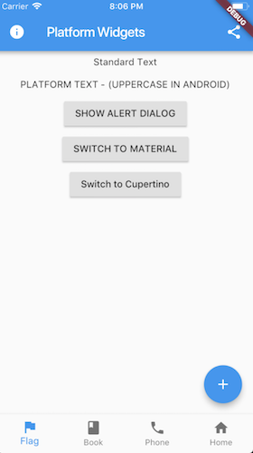
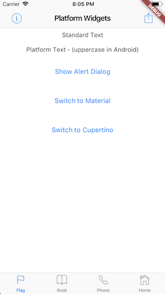

# Flutter Platform Widgets

This project is an attempt to see if it is possible to create widgets that are platform aware. Currently in order to render targted Android or iOS device specific styles, you need to either conditionaly check the platform or create a set of widgets to render differently depending on the running platform.

# Widgets

These set of widgets allow for rendering based on the target platform using a single cross platform set of widget.





Each `PlatformWidget` provides common properties directly as constructor arguments. If required further customization can be achieved by using the platform widget builder. See the **Enhance** section of each widget.


## PlatformWidget

A widget that will render either the android widget or cupertino widget based on the target platform.
```
Widget flagIcon() {
  return PlatformWidget(
    ios: (_) => Icon(CupertinoIcons.flag),
    android: (_) => Icon(Icons.flag),
  );
}
```

## PlatformText
A widget that will render uppercase for Android. iOS will remain unchanged.
```dart
PlatformText('Cancel');  
```

## PlatformButton
A button that will render a `RaisedButton` for android or a `CupertinoButton` for iOS.
```dart
Widget sendButton() {
  return PlatformButton(
    onPressed: () => print('send'),
    child: PlatformText('Send'),
  );
}
```

#### Enhance
Extend with `WidgetBuilder` for android or iOS. 
```dart
Widget sendButton() {
  return PlatformButton(
    onPressed: () => print('send'),
    child: PlatformText('Send'),
    android: (_) => MaterialRaisedButtonData(...),
    ios: (_) => CupertinoButtonData(...)
  );
}
```

## PlatformIconButton
A clickable (tappable) button with an icon.
```dart
Widget infoIconButton() {
  PlatformIconButton(
    onPressed: () => print('info pressed'),
    iosIcon: Icon(
      CupertinoIcons.info,
      size: 28.0,
    ),
    androidIcon: Icon(Icons.info)
  );
}
```
#### Enhance
Extend with `WidgetBuilder` for android or iOS. 
```dart
Widget infoIconButton() {
  PlatformIconButton(
    onPressed: () => print('info pressed'),
    iosIcon: Icon(CupertinoIcons.info),
    androidIcon: Icon(Icons.info),
    android: (_) => MaterialIconButtonData(...),
    ios: (_) => CupertinoIconButtonData(...),
  );
}
```

## PlatformScaffold
A Scaffold that provides the correctly hosted header (AppBar) and navigation bar (Bottom Bar) for each platform

```dart
return PlatformScaffold(
  appBar: PlatformAppBar()
  body: _buildContent(),
  bottomNavBar: PlatformNavBar(),
);
```

#### Enhance
Extend with `WidgetBuilder` for android or iOS. 
```dart
return PlatformScaffold(
  appBar: PlatformAppBar()
  body: _buildContent(),
  bottomNavBar: PlatformNavBar(),
  android: (_) => MaterialScaffoldData(...)
  ios: (_) => CupertinoScaffoldData(...);
);
```

## PlatformAppBar
The AppBar is the top Header bar with a title, leftside or rightside buttons.
```dart
return PlatformAppBar(
      title: new Text('Platform Widgets'),
      leading: PlatformIconButton()),
      trailingActions: <Widget>[
        PlatformIconButton(),
      ],
    );
```
#### Enhance
Extend with `WidgetBuilder` for android or iOS. 
```dart
return PlatformAppBar(
  title: new Text('Platform Widgets'),
  leading: PlatformIconButton()),
  trailingActions: <Widget>[
    PlatformIconButton(),
  ],
  android: (_) => MaterialAppBarData(...),
  ios: (_)=> CupertinoNavigationBarData(...),
);
```

## PlatformNavBar
The NavBar is placed at the bottom of the page with a set of buttons that typically navigate between screens. Implementing this widget requires the parent widget to manage the `currentIndex` of the page and to set `PlatformNavBar.currrentIndex`
```dart
return PlatformNavBar(
  currentIndex: _selectedTabIndex,
  itemChanged: (index) => setState(
        () {
          _selectedTabIndex = index;
        },
      ),
  items: [
    BottomNavigationBarItem(),
    BottomNavigationBarItem(),
  ],
);
```
#### Enhance
Extend with `WidgetBuilder` for android or iOS. 
```dart
return PlatformNavBar(
  currentIndex: _selectedTabIndex,
  itemChanged: (index) => setState(
        () {
          _selectedTabIndex = index;
        },
      ),
  items: [
    BottomNavigationBarItem(),
    BottomNavigationBarItem(),
  ],
  android: (_) => MaterialNavBarData(...);
  ios: (_) => CupertinoTabBarData(...),
);
```

## PlatformAlertDialog
The AlertDialog will render a caption/title, body/text and a set of action buttons specific for the platform.

> Note that `showDialog` from the material package needs to be used.


```dart
showDialog(
  context: context,
  builder: (_) => PlatformAlertDialog(
        title: Text('Alert'),
        content: Text('Some content'),
        actions: <Widget>[
          PlatformDialogAction(),
          PlatformDialogAction(),
        ],
      ));
```
#### Enhance
Extend with `WidgetBuilder` for android or iOS. 
```dart
showDialog(
  context: context,
  builder: (_) => PlatformAlertDialog(...);
  ios: (_) => CupertinoAlertDialogData(...),
  android: (_) => MaterialAlertDialogData(...),
)
```

## PlatformDialogAction
The DialogAction widget is used to describe the set of buttons on the AlertDialog
```dart
PlatformDialogAction(
  child: PlatformText('Cancel'),
  onPressed: () => Navigator.pop(context),
),
```
#### Enhance
Extend with `WidgetBuilder` for android or iOS. 
```dart
PlatformDialogAction(
  child: PlatformText('Cancel'),
  onPressed: () => Navigator.pop(context),
  android: (_) => MaterialDialogActionData(...),
  ios: (_) => CupertinoDialogActionData(...),
),
```

# TODO

The following are a list more platform aware widgets needing to be added.

- Switch  [iOS](https://docs.flutter.io/flutter/cupertino/CupertinoSwitch-class.html) [android](https://docs.flutter.io/flutter/material/Switch-class.html)
- Progress Indicator  [iOS](https://docs.flutter.io/flutter/cupertino/CupertinoActivityIndicator-class.html) [android](https://docs.flutter.io/flutter/material/CircularProgressIndicator-class.html)
- Routing  [iOS](https://docs.flutter.io/flutter/cupertino/CupertinoPageRoute-class.html) [android](https://docs.flutter.io/flutter/material/MaterialPageRoute-class.html)

# Changing / Checking Platform

When importing `flutter_platform_widgets` you can check `isMaterial` or `isCupertino` to determine what style will be used. This is independent to `Platform.isAndroid` or `Platform.isIOS` from `'import 'dart:io'`

See the example code for how this is used.

# Known Limitations

- Setting `BottomNavigationBarType.shifting` will cause the icon and text to render white: https://github.com/flutter/flutter/issues/15280. 

Best to set to fixed if the number of navigation items are 4 or more.
```
return PlatformNavBar(
      android: (_) => MaterialNavBarData(
            type: BottomNavigationBarType.fixed,
          ),
```

- Setting `BottomNavigationBar.fixedColor` to anything has no effect.


# Issues and Feedback

Please [create](https://github.com/aqwert/flutter_platform_widgets/issues/new) an issue to provide feedback or an issue.

# Acknowledgements

Inspired by the example given by Swav Kulinski (https://github.com/swavkulinski/flutter-platform-specific-widgets)
